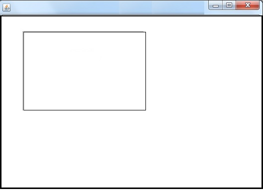
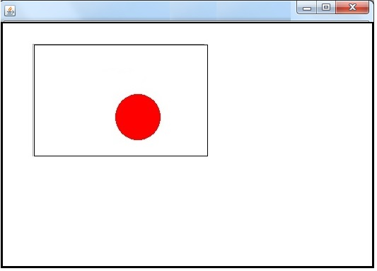
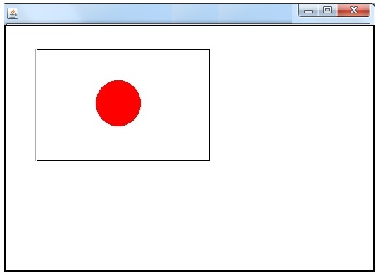
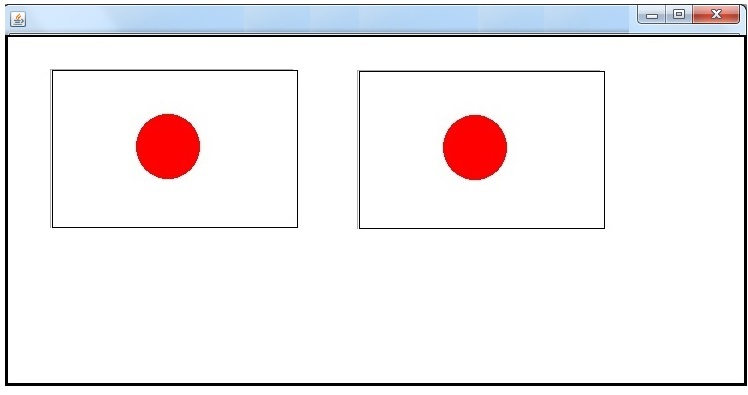
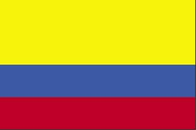
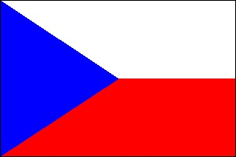

# Using GraphicsContext Methods

## DrawFlags

In this exercise you get more experience using GraphicsContext methods to draw flags of the world. You might want to open up the Javadoc for
the Graphics class at <http://docs.oracle.com/javafx/2/api/javafx/scene/canvas/GraphicsContext.html>

## Setting up

Using the [lab-09 maven project](https://github.com/mpc-csis/csis10a-lab-09) in IntelliJ or Visual Studio Code, create a new class `DrawFlag`. You can copy the following code block to begin your program, which contains all the import
statements. Note that our `DrawFlag ` class extends [`Application`](http://docs.oracle.com/javafx/2/api/javafx/application/Application.html), which means it inherits all of the properties of the `Application` class (we will talk more about this in future labs).

```java
package csis10a.javafx;

import javafx.application.Application;
import javafx.geometry.Point2D;
import javafx.scene.Scene;
import javafx.scene.canvas.Canvas;
import javafx.scene.canvas.GraphicsContext;
import javafx.scene.layout.BorderPane;
import javafx.scene.shape.Rectangle;
import javafx.stage.Stage;

public class DrawFlag extends Application {

    public static void main(String[] args) {
        // 'launch' is a method that is inherited from 'Application'
        launch(args);
    }

    @Override
    public void start(Stage stage) throws Exception {
        stage.setTitle("Drawing Operations Test");
        // Use Border pane to center content
        BorderPane pane = new BorderPane();
        Canvas canvas = new Canvas(800, 500); // canvas is what we draw our pictures on
        pane.setCenter(canvas);               // add orderPane so it resizes correctly
        GraphicsContext gc = canvas.getGraphicsContext2D();
        draw(gc);
        stage.setScene(new Scene(pane));
        stage.show();                         // Display the stage on the screen
    }

    public void draw(GraphicsContext g) {
        // draw a filled rectangle
        g.fillRect(50, 100, 20, 40);          // 20x40 at upper left corner (50,100)
    }

    public static Point2D findCenter(Rectangle rect) {
        double x = rect.getX() + rect.getWidth() / 2;
        double y = rect.getY() + rect.getHeight() / 2;
        return new Point2D(x, y);
    }
}           
```
                

First run the program and observe the test oval that is printed. Change the `paint` method according to the instructions below so that you print the outline of what will become a Japanese flag. 

```java
//Create a new Rectangle object for the frame of the flag image
//Draw the outline of the flag using the values in your frame Rectangle
```


We will find it convenient to use a Rectangle to keep the information about the frame (outline) of the flag. You can create the frame using the statement   `Rectangle frame = new Rectangle(80, 50, 200, 130); `To draw the outline of the frame, use the `g.drawRect` command and feed it the values in your `frame `rectangle. In other words, `g.strokeRect(frame.getX(), frame.getY(), frame.getWidth(), frame.getHeight());` When you have this working, your graphics window should look something like
this:

\

Next we will make another Rectangle to represent the sun in the Japanese flag. This rectangle should be located at the center of the frame rectangle which we will store in a Point object. In other words,

```java
//Find the center of your frame Rectangle using the findCenter method
//  store the result in a Point variable called center
//Change the color to red
//Make another Rectangle called sun
//  the x, y of sun should be the same as the x, y of center
//  the width and height of sun should be one fourth the width of the frame Rectangle
//Draw a filled oval where the sun Rectangle is located.
```

To find the center of the frame, use the command  `Point2D center = findCenter(frame);` This uses the `findCenter ` method to locate and return the center of `frame ` as a ` Point ` object.  To change the color to red, use the command `g.setStroke(Color.RED);` To make the `sun `Rectangle have the same location as the center of the `frame`, and a size one fourth the width of frame, use the command `Rectangle sun = new Rectangle(center.getX(), center.getY(), frame.getWidth()/4, frame.getWidth()/4);`

Finally draw the sun using the `fillOval` command, just as you would the `strokeRect` command. Now when you run your program the graphics window should look like:

 \

Unfortunately, the sun is not located properly. Before drawing the sun, see if you can figure out how to move the sun rectangle one-half of its own width to the left and up. Hint refer to the the `setX()` and `setY()` methods of [Rectangle](http://docs.oracle.com/javafx/2/api/javafx/scene/shape/Rectangle.html).


When you are finished the flag should look like this:




## Making a `japaneseFlag `method

Our solution would be more useful if we put it into a method. That way we could print multiple copies of the Japanese flag at different sizes and locations on our canvas. To work this way, the method should receive a Graphics object and a frame rectangle as a parameter and use that to locate and size the flag being drawn. We'll add a method below paint to accomplish this.

```java
public static void japaneseFlag(GraphicsContext g, Rectangle frame) {
    // copy the code in your paint method here, but 
    // DELETE the line: Rectangle frame = new Rectangle(80, 50, 200, 130); after you paste it
}
```

Then modify paint to use your `japaneseFlag `method. Such as:

```java
public void draw(Graphics g) {
    Rectangle frame = new Rectangle(80, 50, 200, 130);
    japaneseFlag(g, frame);
    frame.setX(frame.getX() + 250);
    japaneseFlag(g, frame);
}
```

You should now see something like:



Having accomplished this much, we can now make many copies of our flag using a while loop:

```java
public void draw(GraphicsContext g) {
    Rectangle frame = new Rectangle(40, 20, 50, 30); // notice we shrunk the flag
    int count = 0;
    while ( count < 5) {
        // draw your flag at the current location of frame
        // move frame over 60 to the right
        // add 1 to count
    }
}
```

You should now see a row of 5 flags.

## Make a `columbianFlag `method

Follow the same process to create a `columbianFlag `method as shown. Add a row of 5 Columbian flags beneath the row of Japanese flags.

\

## Make a `swedishFlag `method

Repeat the process to make a row of Swedish flags below the Columbian flags. Note that this can be drawn as a single blue rectangle with two yellow rectangles on top.

\


## Make a `czechFlag `method

Repeat the process to make a row of Czech flags below the Swedish flags. Use the `fillPolygon` method to draw the triangle. Just a reminder that [`fillPolygon`](http://docs.oracle.com/javafx/2/api/javafx/scene/canvas/GraphicsContext.html#fillPolygon(double%5B%5D,%20double%5B%5D,%20int)) uses double arrays like this:

```java
// fillPolygon(xPoints, yPoints, numberOfPoints);
fillPolygon(new double[]{10, 20, 30}, new double[]{30, 20, 10}, 3);
```
                



When you are finished, you should now have 20 flags on your screen. Call the instructor over for check off.

If you are looking for a challenge you might think about how to make a UK flag method. How many shapes would you need?

\
